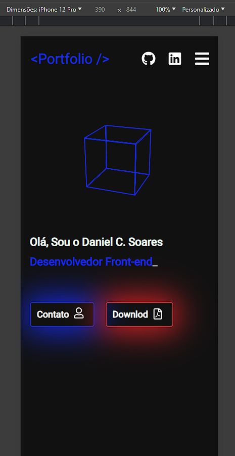

# Portfólio Danielcsxx

Olá! Seja muito bem vindo(a)!  
Aqui estão reunidos todos os detalhes deste meu mais novo Projeto/ Portfólio.  

 

---

  <h2>
    <a href="#-sobre">Sobre</a> |
    <a href="#-tecnologias-utilizadas">Tecnologias</a> |
    <a href="#-capturas-de-tela">Capturas de Tela</a>
  </h2>

 
 

## 🧠 Sobre

### Desenvolvimento e Desafios

---

Há um bom tempo, eu vinha trabalhando no desenvolvimento de um portfólio pessoal profissional, minha ideia desde eo início era de reunir as minhas principais hard sKills alinhadas com as minhas soft skills.
Minha primeira versão criada foi toda desenvolvida com JavaScript, HTML5 e CSS3 e com isso onfesso que achei "básico" (um grande erro meu), com isso acabei não 'subindo' este meu projeto para de fato usa-lo como portfólio.

Posteriormente esse ano resolvi finalmente tirar essa ideia do baú e resolvi criar algo novo, do zero, só que dessa vez com as minhas principais hard skills.
E foi assim que esse projeto foi desenvolvido! Meu intuito era o de alinhar a prática com os meus estudos e criar algo legal, sem pressa e sem data apertada para 'entrega da demanda'.
Dito isso, criei este meu portfólio, onde cada detalhe (por mais simples que seja) foi criado do zero. _*Quando digo criado do zero, me refiro a não usar uma base ou trechos de código prontos,
obivamente não criei nenhuma das libs presentes netes projeto em conjunto com toda a complexidade das tecs usadas hahaha.*_

Foi um desafio particularmente incrível! Aprendi diversos recursos novos, testei diversas libs diferentes e sem dúvidas uma das melhores partes,
foi aprimorar o meu conhecimento em quanto desenvolvia cada parte deste projeto.

Bom, sem mais demoras, a baixo segue diversas informações bem legais a respeito deste projeto, como as principais tecs que usei e todos os demais detalhes relacionados a ele.

Quaisquer dúvidas, existem diversas formas de entrarmos em contato, sinta-se a vontade para utilizar a que lhe for melhor, retorno o seu contato assim que puder.

---

 

### Responsividade 🎯

Este Portfólio foi criado visando a sua responsividade para acesso tanto por meio de dispositivos desktop, como tambem por dispositivos mobile.
Uma grande parte dos acessos a aplicações hoje em dia se dão por meio dos dispositivos mobile, com isso implementei uma boa responsividade a ele
garantindo que a experinência visual seja tão boa quanto no uso em destktop.
_Sinta-se a vontade para experimentar também essa aplicação no seu dispositivo mobile._

 

### Link para acesso do Portfólio

### Deploy Status

 

---

## 📷 Capturas de Tela

_*Aqui estão algumas capturas de tela do projeto em ambiente desktop e mobile.*_  

 
*Aplicação em ambiente desktop.*
 

---

 
*Adição em ambiente mobile.*
 

 

---

## 💻 Tecnologias Utilizadas

Aqui estão as principais tecnologias implementadas neste projeto:

- ### React.JS
- ### TypeScript
- ### Styled Components
- ### React Icons - Fontawesome
- ### Axios
- ### Formik + Yup
- ### Typed.JS
- ### React Toastify

---

## 🚀 LinkTree para Contato

---

 

  <a href="#supermarkerlist" style="display: inline-block; margin-top: 20px;">🔝 Voltar ao Topo</a>

